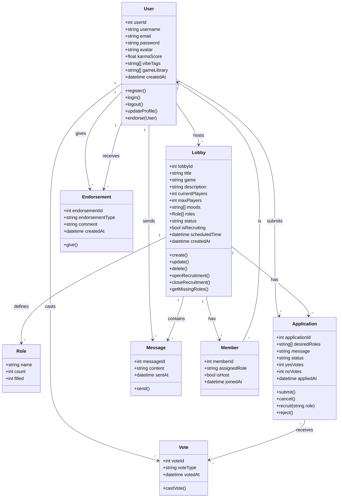
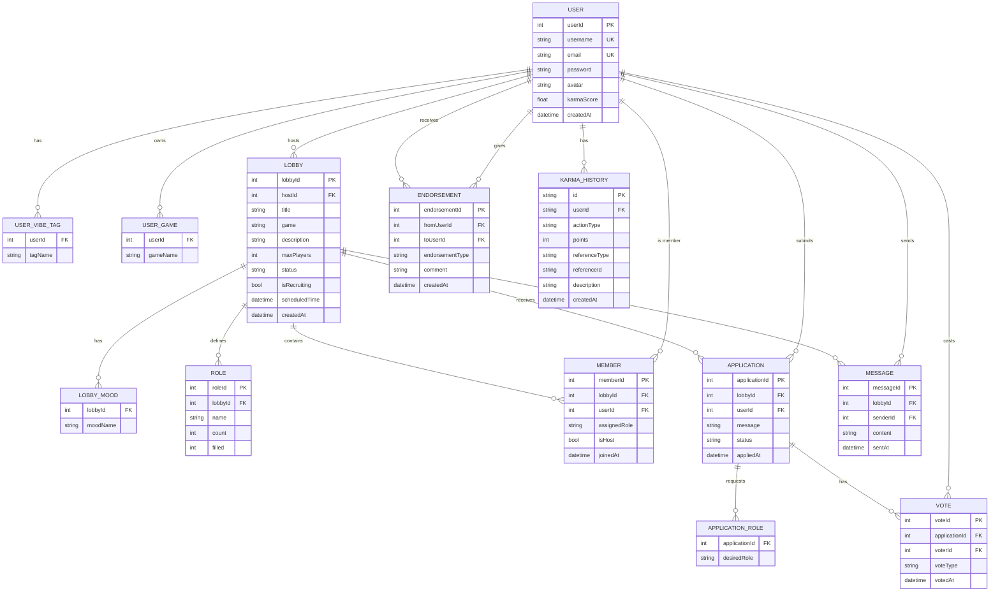
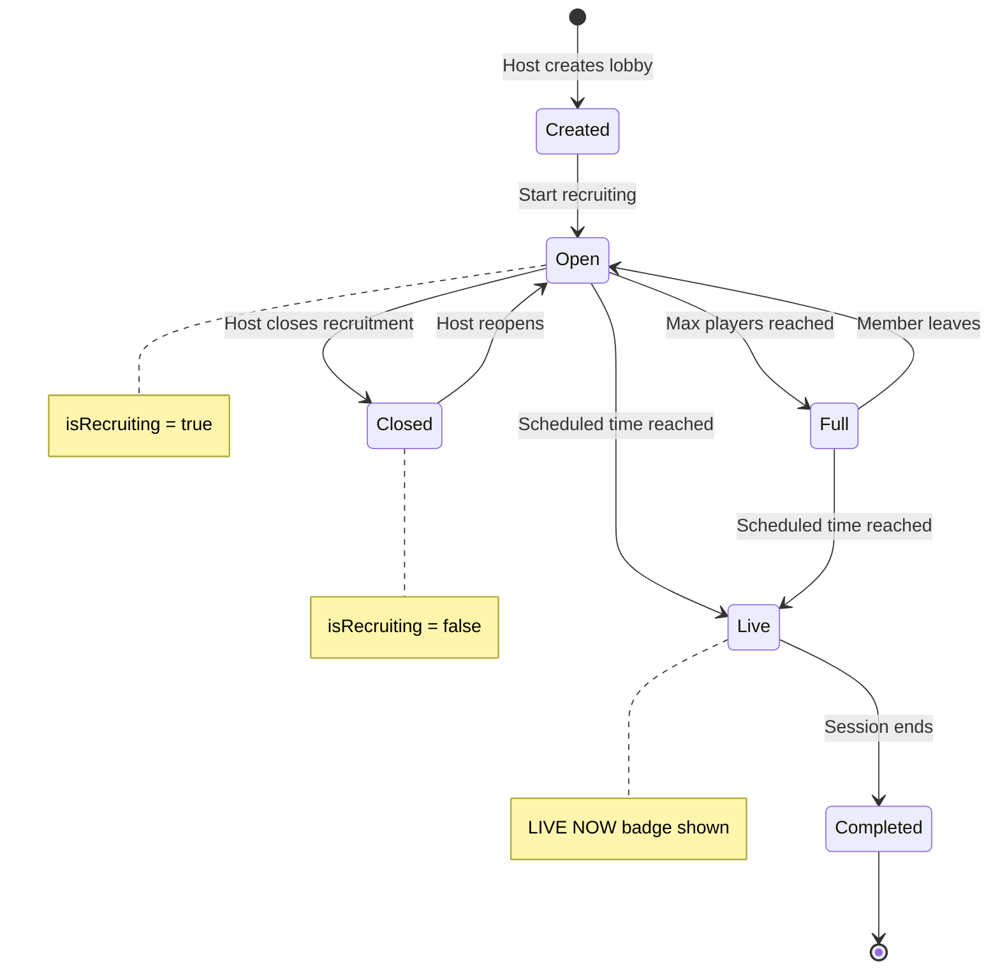
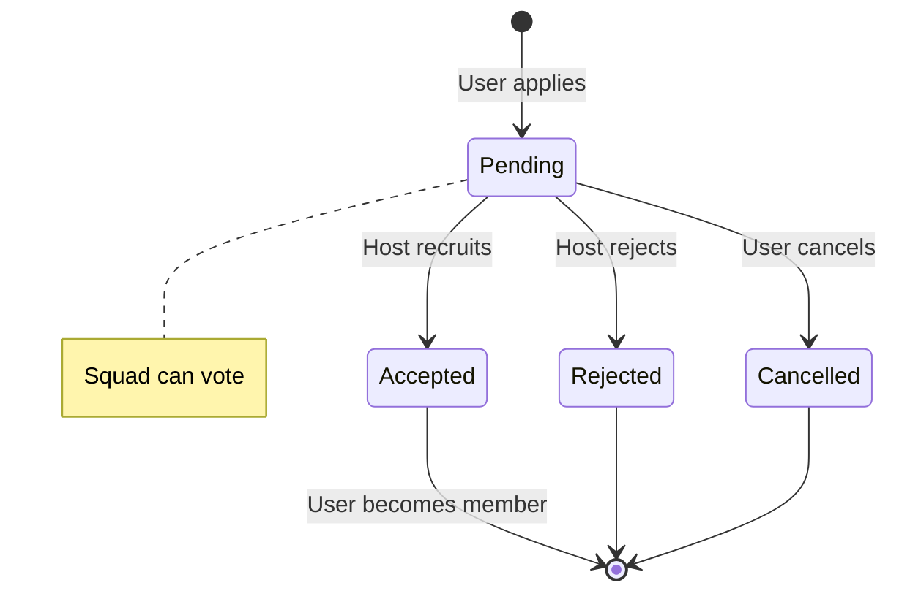
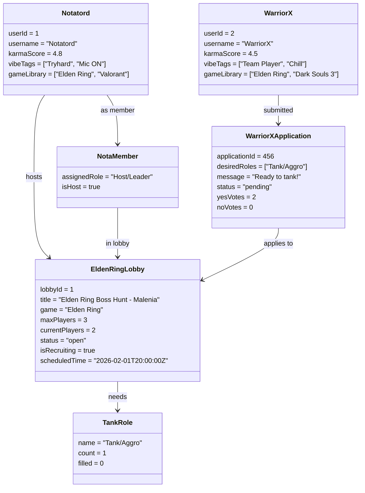
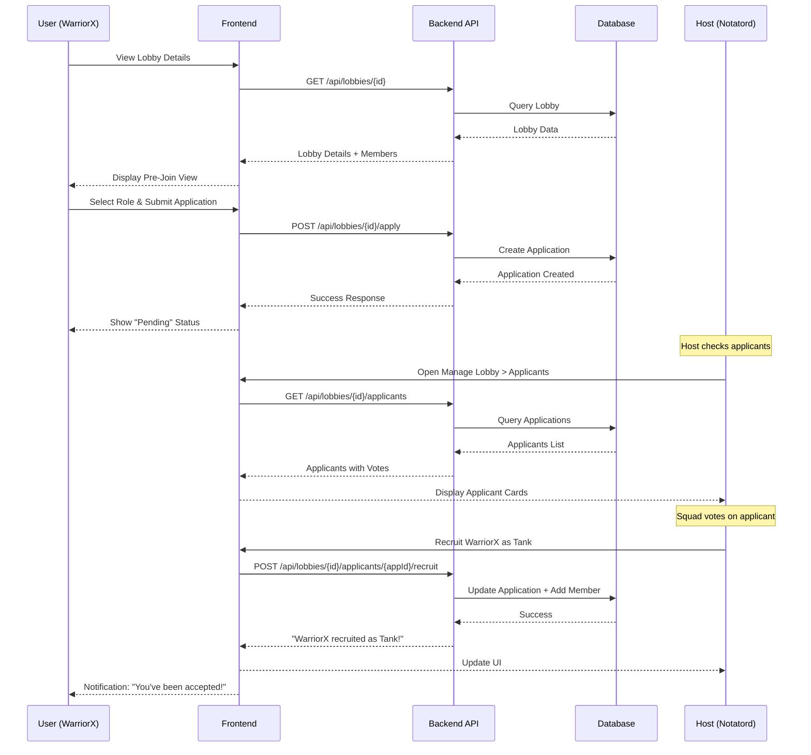

# 📊 System Diagrams - Gamer LFG

เอกสารนี้แสดง Class Diagram และ Entity Relationship เพื่ออธิบายโครงสร้างของระบบ Gamer LFG

---
ctrl+shift+v เพื่อดู
## 🏗️ Class Diagram

---

## 🔄 Entity Relationship Diagram (ERD)

---

## 🔁 State Diagram - Lobby Lifecycle

---

## 🔁 State Diagram - Application Lifecycle

---

## 🧩 Object Diagram - Example Scenario

แสดงตัวอย่าง Instance ของ Objects ในระบบ:

---

## 📡 Sequence Diagram - Apply to Lobby Flow

---

## 🎯 Use Case Diagram

```mermaid
flowchart TB
    subgraph Users
        Guest["👤 Guest"]
        Member["👥 Member"]
        Host["👑 Host"]
    end
    
    subgraph Authentication
        Register["📝 Register"]
        Login["🔐 Login"]
        Logout["🚪 Logout"]
    end
    
    subgraph Lobby_Management
        CreateLobby["➕ Create Lobby"]
        EditLobby["✏️ Edit Lobby"]
        DeleteLobby["🗑️ Delete Lobby"]
        CloseRecruit["🔒 Close Recruitment"]
        ViewApplicants["👀 View Applicants"]
        RecruitMember["✅ Recruit Member"]
        RejectMember["❌ Reject Member"]
    end
    
    subgraph Lobby_Interaction
        ViewFeed["📋 View Activity Feed"]
        ViewDetails["🔍 View Lobby Details"]
        ApplyLobby["📨 Apply to Lobby"]
        CancelApp["❌ Cancel Application"]
        VoteApplicant["🗳️ Vote on Applicant"]
        SendMessage["💬 Send Message"]
        ViewChat["💬 View Lobby Chat"]
    end
    
    subgraph Profile
        ViewProfile["👤 View Profile"]
        EditProfile["✏️ Edit Profile"]
        EndorseUser["⭐ Endorse User"]
    end
    
    Guest --> Register
    Guest --> Login
    Guest --> ViewFeed
    Guest --> ViewDetails
    
    Member --> Logout
    Member --> ViewFeed
    Member --> ViewDetails
    Member --> ApplyLobby
    Member --> CancelApp
    Member --> CreateLobby
    Member --> ViewProfile
    Member --> EditProfile
    Member --> EndorseUser
    Member --> VoteApplicant
    Member --> SendMessage
    Member --> ViewChat
    
    Host --> EditLobby
    Host --> DeleteLobby
    Host --> CloseRecruit
    Host --> ViewApplicants
    Host --> RecruitMember
    Host --> RejectMember
```

---

*Document Version: 1.0*  
*Last Updated: 2026-01-31*
